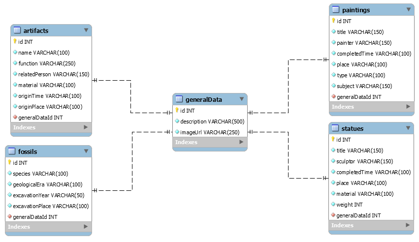

# Rendszerterv

## Adatbázisterv

A múzeum honlapján a kiállítás darabjairól megjelenő adatok az adatbázisban szerepelnek. Az adatbázis neve: museum. 4 db kategóriába csoportosíthatók a kiállított tárgyak: festmények, szobrok, fosszíliák, tárgyi leletek. Ezekhez tartozik egy-egy tábla a saját adataikkal, és van egy generalData nevű tábla, mely minden más táblával egy az egyhez kapcsolatban áll. A másik 4 táblában minden rekordhoz tartozik egy leírás és egy kép, és hogy a mezők ismétlődését elkerüljük, ez a két adat külön táblába került. A táblák a generalDataId nevű mezőjükben tárolják az idegenkulcsot ehhez a táblához. Továbbá mindegyik tábla rendelkezik egy int típusú id mezővel, mely auto incrementre van állítva, új rekord felvétele esetén automatikus kap id-t.  A táblákat, kapcsolataikat és a mezők típusait a mellékelt ábra mutatja: 

### Táblák:

**A generalData tábla mezői:**
- id
- description: rövid, max. 500 karakteres leírás az adott kiállítási tárgyról
- imageURL: a kép elérési útvonala

**A paintings tábla mezői:**
- id
- title: a festmény címe
- painter: a festő neve
- completedTime: a festmény befejezésének ideje, varchar tpusú, mert lehet olyan festmény, amelyiknél nem tudjuk pontosan, csak a korszakot ismerjük
- place: a kép keletkezésének helye (bármilyen földrajzi egység megadható, mi ismert)
- type: a festmény típusa (olajfestmény, akvarell stb.)
- subject: a kép témája (csendélet, tájkép, portré stb.)
- generalDataId

**A statues tábla mezői:**
- id
- title: a szobor címe
- sculptor: a szobrász neve
- completedTime: a szobor elkészítésének ideje, varchar tpusú, mert lehet olyan festmény, amelyiknél nem tudjuk pontosan, csak a korszakot ismerjük
- material: a szobor anyaga (bronz, márvány, fa stb.)
- weight: a szobor súlya kg-ban
- generalDataId

**A fossils tábla mezői:**
- id
- species: a maradványhoz tartozó faj neve (pl. triceratops, velociraptor stb.)
- geologicalEra: földtörténeti korszak (pl. pleisztocén, kréta stb.)
- excavationYear: az ásatás éve
- excavationPlace: az ásatás helye
- generalDataId

**Az artifacts tábla mezői:**
- id
- name: a tárgyi lelet megnevezése
- function: a tárgy funkciója (pl. fegyver, munkaeszköz stb.)
- material: a tárgy anyaga (pl. fa, vas, kő stb.)
- originTime: melyik korból származik
- originPlace: származási helye
- generalDataId

## Karbantartási terv
A projektre kiadott fejlesztési idő rövidsége miatt a rendszertervben kitűzött cél egy felhasználói szerepkör nélküli weboldal elkészítése volt, amely minden kiállítási tárgyat megtalálhatóvá tesz rendezett menü segítségével, illetve az elérhetőségekről és a legfontosabb adatokról tájékoztat. A jövőben a honlapnak számos funkcióval kell kiegészülnie, de elsősorban szerepkörökkel. Értelemszerűen ebből kettőre lesz szükség: adminra és felhasználóra. Az adatbázisban szerepelni fog egy előre létrehozott admin, később ez tud több admint felvenni, felhasználók admin státuszúra változtatásával. Az adminok lesznek képesek felhasználókat letiltani és bejegyzéseiket törölni a vendégkönyvől szükség esetén.  
A jövőben kötelezően megvalósítandó funkciók:  
- A látogatók regisztrációval felhasználói fiókot hozhatnak létre user szerepkörrel
- A regisztrált felhasználók online vásárolhatnak belépőjegyet, kedvezményeket vehetnek igénybe
- A regisztrált felhasználók rendelhetnek az ajándékboltból online
- Online vendégkönyv a regisztrált felhasználók részére, melyet az adminok moderálnak
- A kiállítási tárgyakat értékelhetik a felhasználók 1-5 csillaggal tetszésük szerint, minden kategóriából a legnépszerűbb darab megjelenik a főoldalon  
Tervezett jövőbeni fejlesztések:
- Android mobilalkalmazás fejlesztése online jegyvásárlás és ajándéktárgyak rendelése céljából
Technológiai fejlesztések:
- Szükség lesz az adatbázis-szolgáltatónál nagyobb tárhelyet igényelni az adatbázis számára
- A további bővítéséhez célszerű valamilyen keretrendszer használatát bevezetni

## A rendszer celja
A rendszer celja, hogy a muzemban eppen aktulais kiallitasrol barki informaciot szerhezzsen barhol is van a vilagon internet hozzaferessel.
A weboldal kinezete egy egyszerusitett, atgondolt es letisztult felulet lesz.
A rendszer letisztultsaga miatt barki aki minimalisan ert az internethez el tud majd igazodni az oldalon, minden fele gondok nelkul.
Mivel jelenleg csak weboldal keszul ezert sem androidos sem IOS es alkalmazas nem fog keszulni, de mivel celunk egy egyszeruen attekintheto oldal letrehozasa, ami minimalis eroforrasokat hasznal igy nincs is tervben kulon applkiacio letrehozasa.

## Fizikai kornyezet
- Az alkamlazas csakis web platfomra keszul.
- Az weboldal teljesen kezi kodolassal keszul a nullarol
- Fejlesztoi eszkozok:
    - Szoveg - es forraskodszerkesztok: Ajnalott Notepad++ vagy Visual Studio Code de mas preferalt platform hasznalata se tiltott.
    - Adatbazis: MySQL Sorkbench
    - Weboldal: HTML + CSS + JavaScript esetlegesen elofordulhat